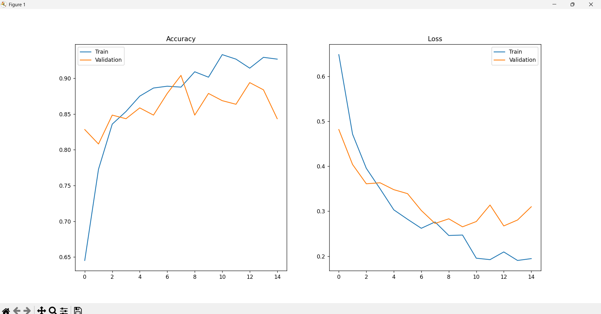
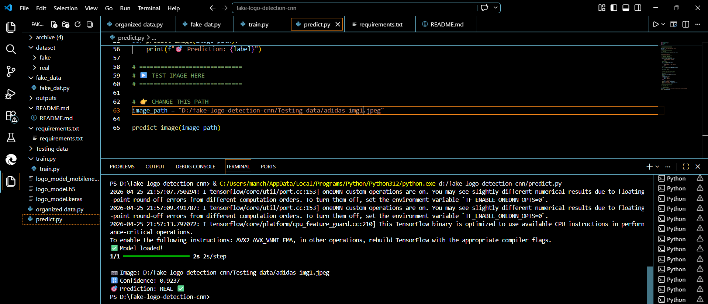
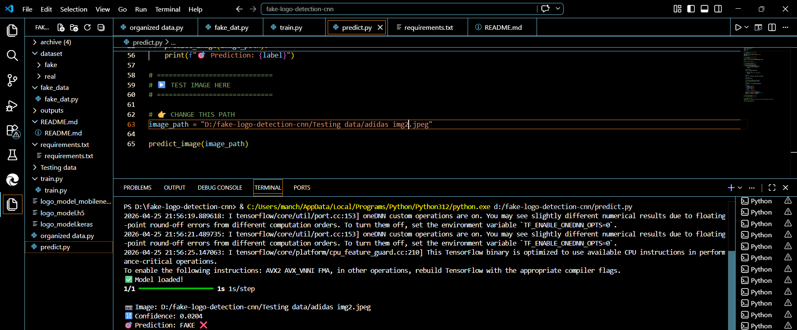
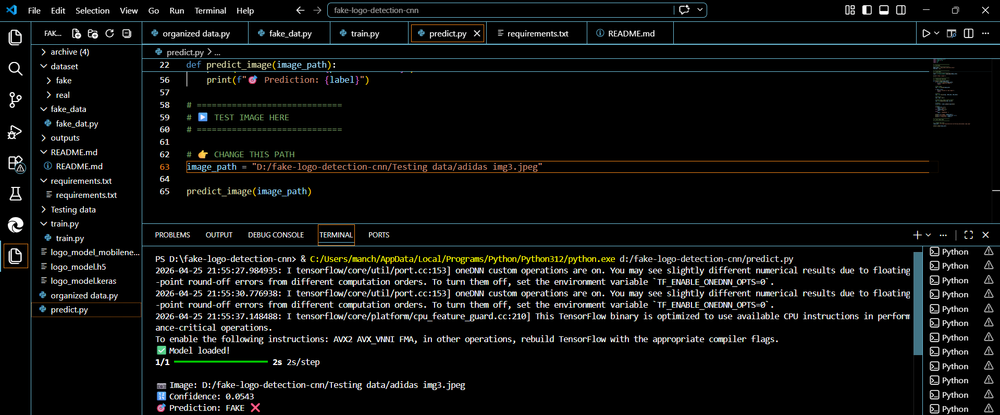

# 🧠 Fake Logo Detection using Deep Learning (CNN + MobileNet)

## 📌 Overview
This project detects whether a logo is **REAL or FAKE** using Deep Learning and Computer Vision techniques.  
It uses **Transfer Learning with MobileNet** to achieve high accuracy on custom logo datasets.

---

## 🎯 Demo
The model classifies logos into:
- REAL ✅
- FAKE ❌
- UNCERTAIN ⚠️ (low confidence cases)

---

## 🚀 Features
- Synthetic fake logo generation using OpenCV
- CNN training using TensorFlow/Keras
- Transfer Learning (MobileNet)
- Real-time image prediction
- Confidence-based classification system

---

## 🧠 Model Architecture
- Pretrained **MobileNet**
- Fine-tuned on custom dataset
- Binary classification (Real vs Fake)

---

## 📊 Results
- Training Accuracy: ~90%
- Validation Accuracy: ~85%
- Good performance on real-world variations

---

## 📁 Dataset
- **Real logos** → clean images  
- **Fake logos** → blurred, noisy, distorted (synthetically generated)

---

## ▶️ How to Run

### 1️⃣ Install dependencies
```bash
pip install -r requirements.txt

2️⃣ Train the model
python train.py

3️⃣ Predict an image
python predict.py

📊 Training Results



## 🧪 Predictions

### Real Logo


### Fake Logo


### Uncertain Case


## 🧪 Example Output
- REAL ✅
- FAKE ❌
- UNCERTAIN ⚠️

⚠️ Limitations
Performance depends on dataset quality
Synthetic fake data may not cover all real-world cases
Some predictions may be uncertain

🔮 Future Improvements
Use real-world counterfeit logo datasets
Build a web app (Streamlit / Flask)
Deploy model (cloud / API)
Improve accuracy with fine-tuning

## 👨‍💻 Author
Manchula Harshitha